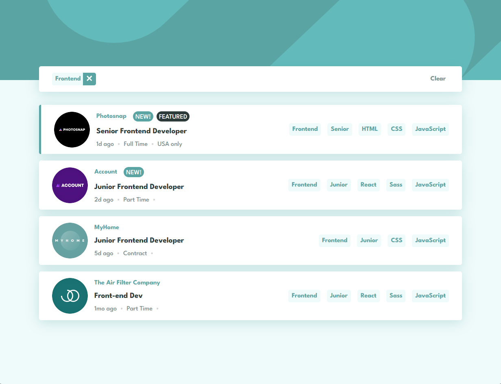

# Frontend Mentor - Job listings with filtering

This is a solution to the [Job listings with filtering challenge on Frontend Mentor](https://www.frontendmentor.io/challenges/job-listings-with-filtering-ivstIPCt). Frontend Mentor challenges help you improve your coding skills by building realistic projects.

## Table of contents

- [Overview](#overview)
    - [The challenge](#the-challenge)
    - [Screenshot](#screenshot)
    - [Links](#links)
- [My process](#my-process)
    - [Built with](#built-with)
    - [What I learned](#what-i-learned)
    - [Useful resources](#useful-resources)
- [Author](#author)
- [Acknowledgments](#acknowledgments)

## Overview

### The challenge

Users should be able to:

- View the optimal layout for the site depending on their device's screen size
- See hover states for all interactive elements on the page
- Filter job listings based on the categories

### Screenshot

### Links

- Solution URL: [Job listings with filtering from "Frontend Mentor" solution](https://www.frontendmentor.io/solutions/job-listings-with-filtering-challenge-Y2XMU9sA18)
- Live Site URL: [Job listings with filtering from "GitHub" page](https://markanthonyjc.github.io/job-listings-with-filtering/)
## My process

### Built with

- React
- Webpack
- [API Mocha](https://apimocha.com/)
- SCSS
- Mobile-first workflow

### Useful resources

- [React](https://reactjs.org) - It helped me to create the components of my app.
- [Webpack](https://webpack.js.org) - It helped me to package my app using different tools and plugins.
- [SCSS](https://sass-lang.com) - It helped me to create the styles of my app.
- [API Mocha](https://apimocha.com/) - It helped me to create the API of my app.

## Author

- LinkedIn - [Mark Anthony JC](https://www.linkedin.com/in/mark-anthony-jorge-cerr%C3%B3n-b3202b156/)
- Frontend Mentor - [@markanthony](https://www.frontendmentor.io/profile/markpiscis21)

## Acknowledgments

Grateful to [Frontend Mentor](https://www.frontendmentor.io) for the opportunity to provide learning content for thousands of people, helping us improve our web application development skills.
